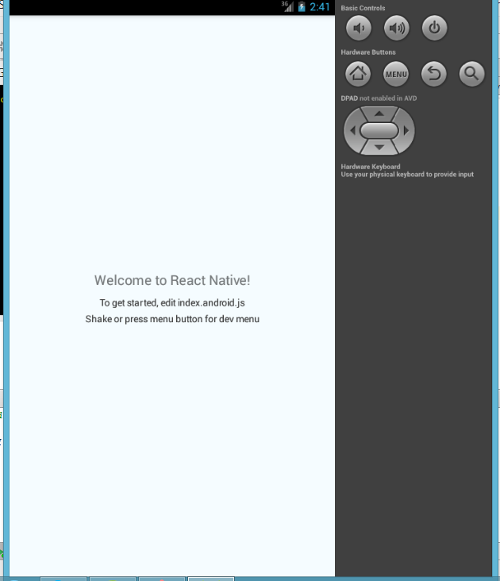

# React-Native-Hello-World

### Deep  Dive into Basic react-native application

* After  the successful completion of installation , please have a look at this [link](http://www.toptal.com/ios/cold-dive-into-react-native-a-beginners-tutorial)
       
* The above [link](http://www.toptal.com/ios/cold-dive-into-react-native-a-beginners-tutorial) will provide you a better understanding of a basic react application.

* Thereafter looks to go deep into the react-native application.
      
### Installation and Setup:
      
* For the installation of react-native and its accessories , please go through [here](https://github.com/Hari70a/React-native/wiki)

* Later you  check the [documentation](https://facebook.github.io/react-native/docs/tutorial.html#content) of facebook to  understand its components specifically.
 
###HelloWorld application

* The code provided in index.android.js will give you an opportunity to learn how to display a welcome message.

* The following output will be displayed while using the code(index.android.js) 

###Run an android application

   * Please go through this [link](https://github.com/Hari70a/React-native/wiki) for installation.Then proceed with the following steps
   * Create a folder named react-native projects  in your drives except c: drive where you can create your own projects like AwesomeProject(a sample hello world project).

    *  Go to your project.
    
               $ cd your project-name(eg. cd f:/awesomeproject)
    
    *  Enter the command for initialization of your project.
    
             $ react-native init AwesomeProject

    * Then start running your android emulator or connect to a device.  

    *  Start your react-native packager.
    
            $ react-native start
###Output Screenshot

